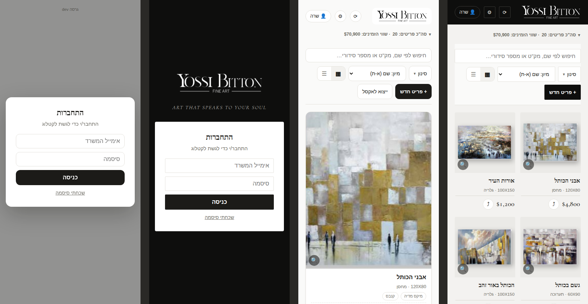
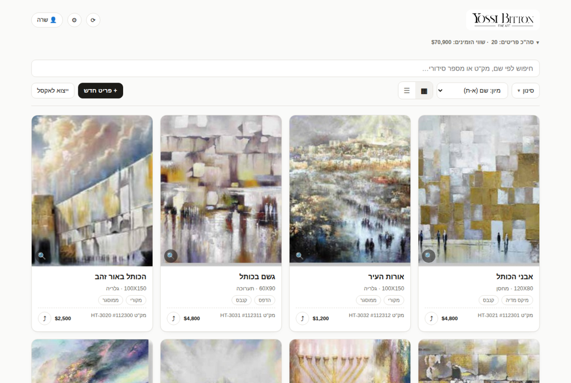
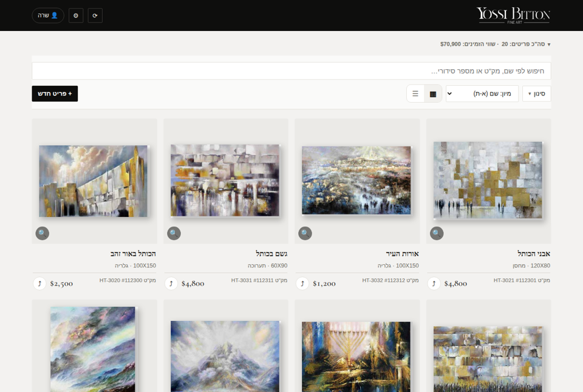
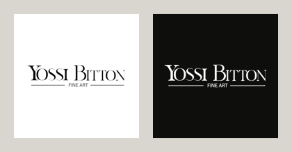

# סקירת עיצוב: האפליקציה מול שפת המותג

*02/10/2026. מסמך לבחירה: שום דבר מכאן לא נכנס לאפליקציה בלי אפיון ואישור (SPEC.md).*

## שפת המותג, כפי שהיא בקטלוג 2025

| מרכיב | בקטלוג |
|------|------|
| **הכריכה** | שחור עמוק, הלוגו בלבן, והסיסמה "ART THAT SPEAKS TO YOUR SOUL" באותיות דקות ונטויות |
| **העמודים** | נייר לבן-אפרפר ומרווח נדיב. היצירה **שלמה**, עם צל רך, כאילו תלויה על קיר |
| **כותרות** | גופן סריף קלאסי, בעברית (מודגש) ובאנגלית |
| **טקסט** | Assistant בעברית, פשוט ונקי |
| **צבע** | שחור, לבן ונייר. הצבע היחיד בא מהיצירות עצמן (זהב, כחול) |
| **צורה** | קווים ישרים, פינות חדות, בלי "קישוטים" |

## מה כבר תואם

- **גופנים:** האפליקציה כבר משתמשת ב-Assistant ובגופן סריף עברי (Frank Ruhl Libre), כמו הקטלוג.
- **צבעים:** פלטה נייטרלית וכפתורים שחורים. זה מתאים למותג.
- **כרטיס השיתוף החדש** כבר בנוי בשפת הקטלוג.

## מה לא תואם, לפי סדר חשיבות

### 1. הלוגו (מה שזיהית) - חשוב

**היום:** הלוגו קטן (34 פיקסלים), יושב על "מדבקה" לבנה עם פינות מעוגלות, ומוקף בכפתורי אימוג'י.
הוא נראה כמו תמונה שהודבקה ולא כחלק מהעיצוב.

**בקטלוג:** הלוגו תמיד לבן על שחור, עם הרבה מקום מסביב.

**ההמלצה:** **פס עליון שחור** לכל הרוחב, עם הלוגו בלבן ובגודל 40 פיקסלים, ואייקונים בהירים
ודקים. זה הדבר הראשון שרואים בכל מסך, ומיד מזהים את המותג.

### 2. היצירות נחתכות - הכי חשוב

**היום:** כל תמונה בכרטיס נחתכת למלבן לאורך (4:5). רוב היצירות לרוחב, ולכן **כמעט חצי מהיצירה
לא נראה**: למשל רק אמצע הכותל, בלי השמיים.

**בקטלוג:** היצירה תמיד שלמה, על רקע נייר, עם צל רך.

**ההמלצה:** היצירה **שלמה**, ממורכזת על "קיר" אפור-נייר, עם צל, כמו בקטלוג ובכרטיס השיתוף. זה
שינוי קטן בקוד, עם ההשפעה הגדולה ביותר: הקטלוג נראה כמו גלריה ולא כמו חנות.

### 3. מסך הכניסה

**היום:** חלון לבן גנרי על רקע אפור. אין לוגו ואין סיסמה. זה הדבר הראשון שאיש צוות חדש רואה.

**ההמלצה:** **"כריכת הקטלוג":** רקע שחור, הלוגו הגדול בלבן, הסיסמה מתחתיו, ומתחת להם טופס הכניסה.

### 4. בטלפון: יצירה אחת למסך

**היום:** כל כרטיס תופס את כל רוחב המסך, ולכן רואים יצירה אחת בכל פעם. כדי לעבור על 147 יצירות
צריך לגלול המון.

**ההמלצה:** **שתי יצירות בשורה** בטלפון, כך שרואים 4-6 יצירות בכל מסך. זה גם נראה כמו קיר של
גלריה. (תצוגת הרשימה נשארת לסריקה מהירה.)

### 5. האייקון במסך הבית של הטלפון

**היום:** הלוגו הרחב קטן מאוד בתוך ריבוע לבן, וכמעט לא קריא. גם צבע המסך שעולה בפתיחה ופס
המצב של הטלפון מוגדרים בזהב ובקרם, שאינם צבעי המותג.

**ההמלצה:** אייקון **שחור עם הלוגו בלבן**, כמו הכריכה, וצבעי פתיחה בשחור ובנייר.

### 6. אייקונים מאימוג'י

**היום:** ⟳ ⚙ 👤 🔍 ⤴ 🖼️ הם אימוג'י. הם נראים אחרת בכל טלפון (אייפון, סמסונג, מחשב), צבעוניים
וקצת "זולים" ליד לוגו של גלריה.

**ההמלצה:** סט אחד של **אייקונים דקים בקו** (שרטוט פשוט), שנראה זהה בכל מכשיר ומתאים לגופן הדק
של הלוגו.

### 7. שמות ומחירים בכרטיס

**ההמלצה:**
- **שם היצירה** בגופן הסריף המודגש, כמו הכותרות בקטלוג.
- **המחיר** בגופן Cormorant Garamond, כמו בכרטיס השיתוף, עם ספרות בגובה אחיד.

### 8. פינות מעוגלות

**היום:** כרטיסים בפינות מעוגלות (14 פיקסלים) וכפתורים בצורת "גלולה". זה סגנון של אפליקציות
צרכניות.

**ההמלצה:** פינות כמעט ישרות (2-4 פיקסלים), כמו בקטלוג: מינימליסטי ויוקרתי.

### 9. עומס מעל היצירות בטלפון

**היום:** 3 שורות של פקדים לפני היצירה הראשונה. "ייצוא לאקסל" הוא כפתור ראשי, למרות שמשתמשים
בו לעיתים רחוקות.

**ההמלצה:**
- **"ייצוא לאקסל"** עובר לתפריט ⚙.
- **בטלפון:** תוויות הסוג והמצב יוצאות מהכרטיס הקטן. הן עדיין מופיעות בטופס ובסינון.

## לפני ואחרי (הדמיה על האפליקציה האמיתית)

*משמאל לימין: כניסה היום ← כניסה מוצעת ← קטלוג היום ← קטלוג מוצע.*

*ההדמיה מראה את כיוון ההמלצות 1-5 ו-7-9. באייקונים הדקים (המלצה 6) והספרות האחידות במחיר (המלצה
7) תופיע רק בגרסה האמיתית.*

## ההמלצה שלי לסדר

| חבילה | מה | למה ראשון |
|------|------|------|
| **א** | 1 (לוגו ופס שחור), 2 (יצירה שלמה), 3 (מסך כניסה), 4 (שתיים בשורה), 5 (אייקון) | הכי נראה, הכי מזוהה עם המותג, וקל יחסית |
| **ב** | 6 (אייקונים), 7 (גופנים בכרטיס), 8 (פינות), 9 (עומס) | ליטוש. כדאי אחרי שהצוות התרגל לחבילה א |

**מצב כהה:** כל ההמלצות עובדות גם במצב כהה של הטלפון. הפס השחור ממילא שחור, ו"הקיר" יהיה אפור כהה.
